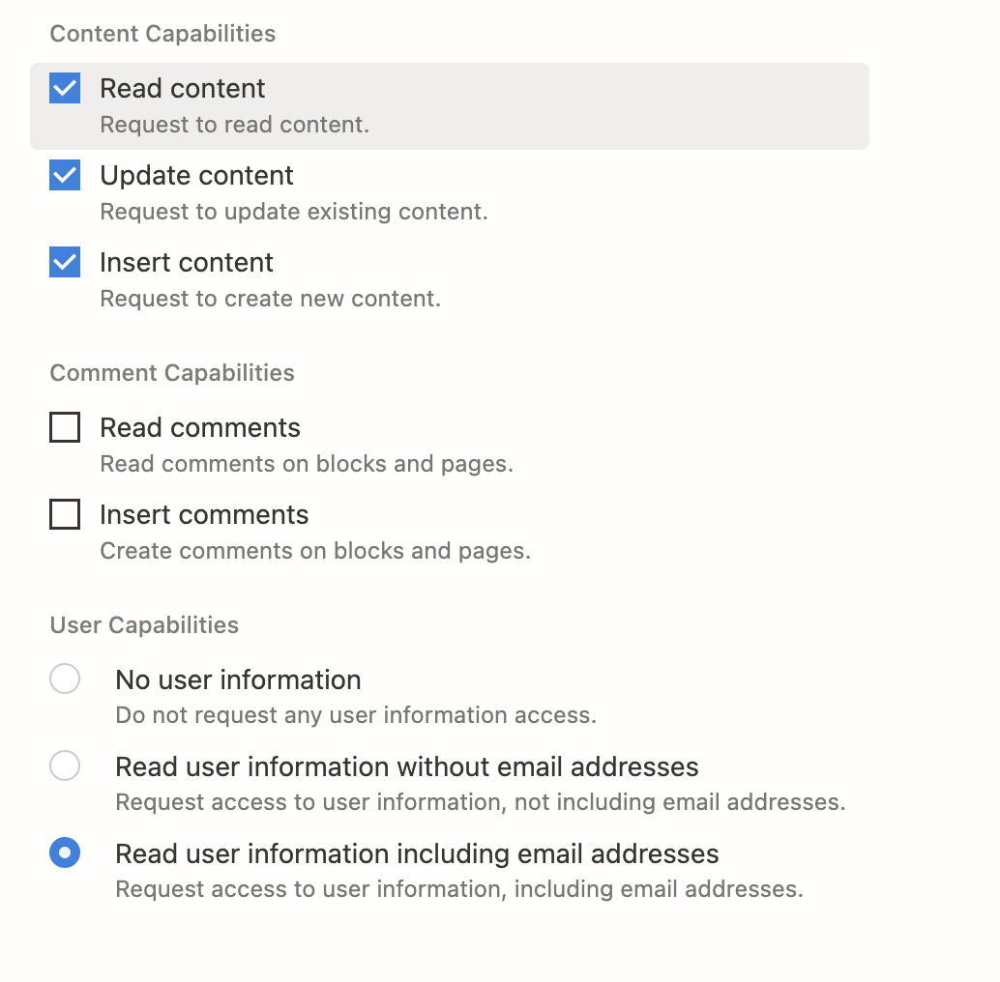

# My Website

The current incarnation of my website is built using NextJS with Typescript and uses Notion as a CMS.  

## Related Systems

### Notion 

You must have a Notion account that allows API access.  The following configuration values must be set in your `.env.local`

* `NOTION_TOKEN="secret_xxxx"`
* `NOTION_BLOG_POSTS_DATABASE_ID="xxx"`
* `NOTION_ABOUT_PAGE_ID="xxxx"`
* `NOTION_RESUME_PAGE_ID="xxxx"`

There are three Notion pages that must be created:

1. **The Blog page**.  The blog page should consist of a single database called "Blogs".  It must have the following properties:
   1. Name - (Type: Title) (primary key)
   2. Slug - (Type: Text) 
   3. Tags - (Type: Multi Select)
   4. Author - (Type: People)
2. **The About Page**.  The about page constists of content and a single database called "References".  The references database has the following properties:
   1. Name - The name of the reference site (e.g. Twitter) (Type: Title)
   2. Image - The logo for the reference - see how images are stored in the Cloudflare section below. (Type: File/Media)
   3. URL - The URL associated with that reference. (Type: URL)
3. **The Resume Page**.  The resume page consists of the following databases (all other content is ignored)
   1. Companies
      1. Name - The name of the company (Type: Title)
      2. Icon - See information about how this image is stored in the Cloudflare sectin below (Type: File/Media)
   2. Experience
      1. Name - This is the position title (Type: Title)
      2. Company - Reference to *Companies* (Type: Reference)
      3. Start - The start date of the position (Type: Date)
      4. End - The end date of the position (Type: Date)
      5. Overview - A blurb about the position (Type: Text)
      6. Bullets - Reference to *Experience Bullets* (Type: Reference)
   3. Experience Bullets
      1. Name - The full description of one notable aspect of the position (Type: Title)
      2. Skills - A list of skills used for this work (Type: Multi Select)
      3. Experience - Reference to the *Experience* table (Type: Reference)
   4. Education
      1. Name - The name of the school (Type: Title)
      2. GraduationDate - The date graduated (Type: Date)
      3. Awards - A set of awards earned or other important information (Type: Multi Select)
      4. Degree - The degree earned (Type: Text)

### Setting up the Integration

You must create a custom integration in order to generate the secret mentioned in the configuration section.  To do that, follow the steps in the Notion documentation for creating personal integrations.

You can visit your personal integrations here:
https://www.notion.so/my-integrations

> Note: You don't need update and insert necessarily but I added it for some things that I wanted to do.

### Vercel

I use Vercel for deployments and hosting.  The `.env.local` contents are associated with the production deployment to ensure that we are using the proper notion backend. 

### Cloudflare

I'm using Cloudflare for image hosting and domain resolution.  Images that are embedded into databases as File/Media types cannot be hosted in Notion because at the time of this writing the S3 storage links provided in API responses for file fields expires which is not good for statically rendered sites.  So, instead, I have configured `static.karim.cloud` in Cloudflare as my R2 bucket domain.  Images that are part of these databases are hosted there for free (they tend to be very small images).  For example, https://static.karim.cloud/ua-logo.png is added to *Companies* database Under Armour row.

## Developing

To get up and running locally:

1. `npm run dev`

To build the static site:

1. `npm run build`

To deploy:

Commit your changes to the main branch and they will automatically be deployed to production.
